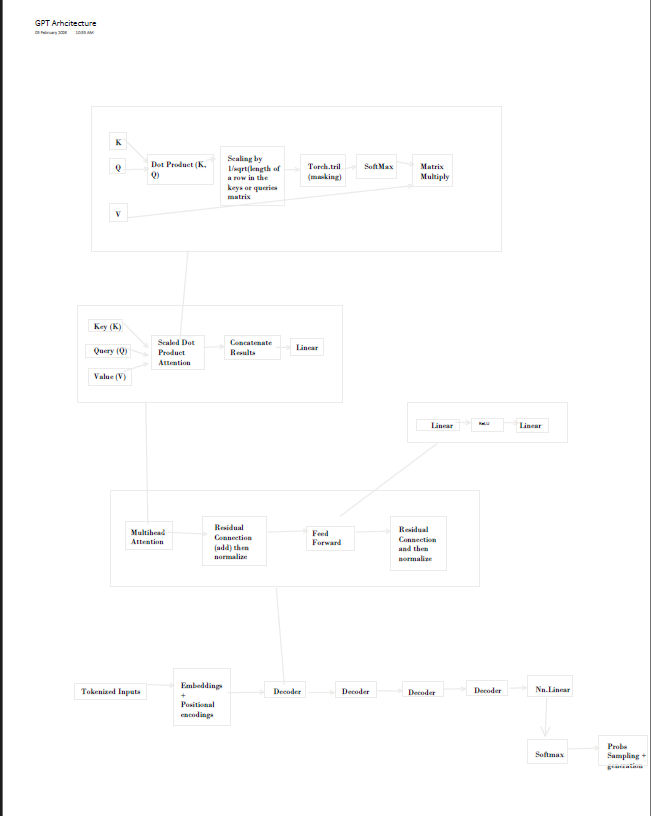

# Tiny GPT From Scratch – 35M Parameter Transformer

Training a ~35M parameter **GPT-style decoder-only Transformer** from scratch using PyTorch.

This project implements a full language model training pipeline including custom tokenization, streaming datasets, mixed precision training, checkpointing, and cosine learning rate scheduling.

The model is trained on the **TinyStories dataset** and is capable of generating short coherent stories after training.

---

# Key Highlights

* ~35M parameter GPT-style decoder Transformer
* Custom **BPE tokenizer (~9.8k vocabulary)**
* Streaming dataset pipeline using HuggingFace datasets
* Mixed precision GPU training with gradient accumulation
* Cosine learning rate scheduling and checkpointing
* Trained on **TinyStories** for coherent story generation

---

# Tech Stack

* Python
* PyTorch
* HuggingFace Datasets
* tokenizers (BPE)
* CUDA / GPU training

---

# Example Output

Prompt:

```
Once upon a time
```

### Generation Example 1

```
Once upon a time , there was a little girl named Lily . She loved going to the beach with her mommy and daddy . 
They were so happy and excited to watch the ocean !

On the beach , Lily saw a little boy sitting on his porch . 
He was crying because he had lost his toy . Lily asked him what was wrong and he said he lost his toy .
Lily didn 't know what to do , but she knew it was okay .
```

### Generation Example 2

```
Once upon a time there were two friends Joe and Jane . 
They liked to play together in the garden . One day Joe wanted a special rock to show Mary . 
He asked Mary if she could try it . Mary was very excited .

So they asked their moms if they could play together , so they agreed to join in . 
They were having so much fun with their friendship .
```

### Generation Example 3

```
Once upon a time , a little girl named Lily went for a walk in the park . 
She saw many things like trees and flowers . 

One day she found a big basket and ran to it . 
Inside she found many toys and started playing again . 

As she was playing , Lily saw a big balloon and thought it would be the perfect snack 
to share with her friends .
```

The model learns:

* basic grammar
* sentence structure
* simple narrative flow
* repeating story patterns common in children's stories

---

# Model Architecture

The model implements a **decoder-only Transformer architecture** similar to GPT models.

Pipeline:

```
Tokens → Token Embeddings → Positional Embeddings
        ↓
Stack of Transformer Decoder Blocks
        ↓
Masked Multi-Head Self-Attention
        ↓
Feed-Forward Layers
        ↓
Linear Projection → Softmax
        ↓
Token Sampling
```

Each Transformer block contains:

* masked multi-head self-attention
* residual connections
* layer normalization
* feed-forward network

Architecture diagram:

```



```

---

# Model Configuration

```
Embedding dimension: 512
Transformer layers: 8
Attention heads: 8
Context window: 256 tokens
Dropout: 0.1
Batch size: 32
Gradient accumulation: 4
```

Total parameters:

```
35,436,155
```

---

# Training Pipeline

Training consists of several stages:

### 1. Train BPE tokenizer

A Byte Pair Encoding tokenizer is trained from a subset of the dataset.

### 2. Stream dataset

The TinyStories dataset is streamed using HuggingFace datasets to avoid loading the entire dataset into memory.

### 3. Build training sequences

Token streams are converted into fixed-length input-target sequences for next-token prediction.

### 4. Train transformer

The model learns using cross-entropy loss between predicted logits and target tokens.

---

# Optimization Techniques

To stabilize training and improve efficiency, the following techniques were used:

* **Mixed precision training** using `torch.amp`
* **Gradient accumulation** to simulate larger batch sizes
* **Cosine learning rate decay** after initial training phase
* **Checkpoint saving and resume support**

---

# Project Development History

This project evolved through multiple stages while exploring how language models learn.

### Stage 1 — Bigram Model

The project began with a **character-level bigram language model** trained on *The Wizard of Oz*.
It learned small character patterns but could not capture long-range structure.

### Stage 2 — Transformer Architecture

The bigram model was replaced with a **GPT-style transformer architecture** with multiple attention heads and transformer blocks.

### Stage 3 — Dataset Scaling Attempt

Training was initially attempted on **OpenWebText**, but the dataset proved too complex for the model size and compute limits.

### Stage 4 — Tokenization Upgrade

Character tokenization produced extremely long sequences and limited learning efficiency.

The tokenizer was replaced with **Byte Pair Encoding (BPE)**.

### Stage 5 — Dataset Switch

The dataset was changed to **TinyStories**, which is designed for smaller language models.

This allowed the model to converge and produce coherent text.

### Stage 6 — Training Optimization

Several improvements were added:

* streaming dataset pipeline
* mixed precision training
* gradient accumulation
* cosine learning rate decay

These optimizations stabilized training and improved generation quality.

---

# Repository Structure

```
tiny_gpt_from_scratch/
│
├── tiny-gpt-from-scratch.ipynb
├── GPT_Architecture.pdf
├── README.md
├── requirements.txt
└── .gitignore
```

---

# License

MIT License

---

# Author

Arya Mishra
